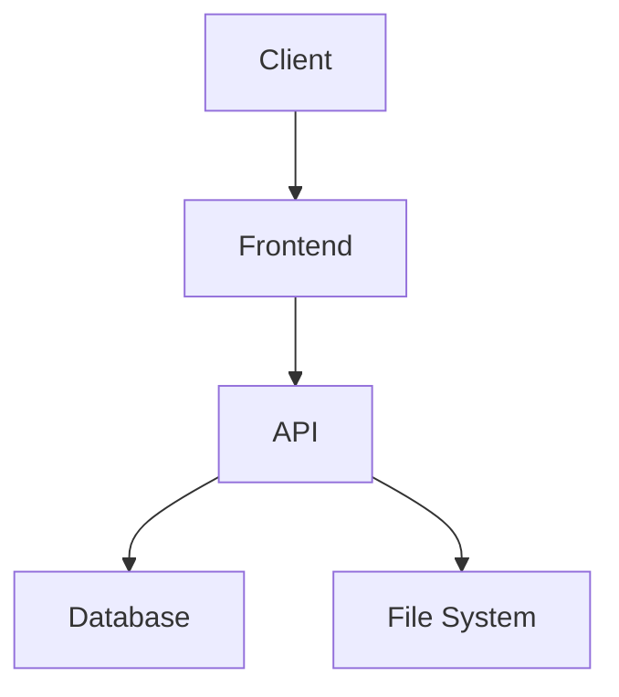

# Project Alpha

## Overview

Project Alpha is a web-based application for managing documentation.

## Status

| Milestone | Status | Due Date |
|-----------|--------|----------|
| Planning | ✅ Complete | 2024-01-01 |
| Design | ✅ Complete | 2024-01-10 |
| Development | 🔄 In Progress | 2024-02-01 |
| Testing | ⏳ Pending | 2024-02-15 |
| Launch | ⏳ Pending | 2024-03-01 |

## Tech Stack

```
Frontend: SvelteKit + Tailwind CSS
Backend: Python FastAPI
Database: SQLite with FTS5
Deployment: Docker
```

## Requirements

### Functional Requirements

1. User authentication
2. Multi-vault support
3. Full-text search
4. Markdown rendering
5. Responsive design

### Non-Functional Requirements

- Performance: < 200ms page load
- Availability: 99.9% uptime
- Security: Encrypted at rest and in transit

## Architecture

> [!info] Architecture Decision
> We chose a monolithic architecture for simplicity, with the option to split services later.



## Team

- **Project Lead**: Alice
- **Backend Developer**: Bob
- **Frontend Developer**: Carol
- **DevOps**: Dave

## Links

- [[Welcome]] - Main documentation
- [[Markdown Features]] - Feature documentation
- [[Daily Notes/2024-01-15]] - Latest daily note

## Changelog

### v0.1.0 (2024-01-15)

- Initial project setup
- Basic authentication
- Vault reading functionality

---

#project #active #web-development

